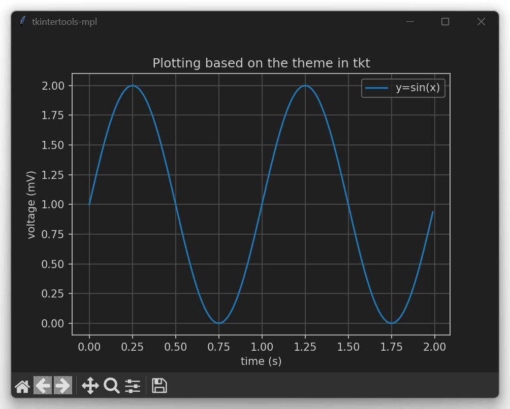
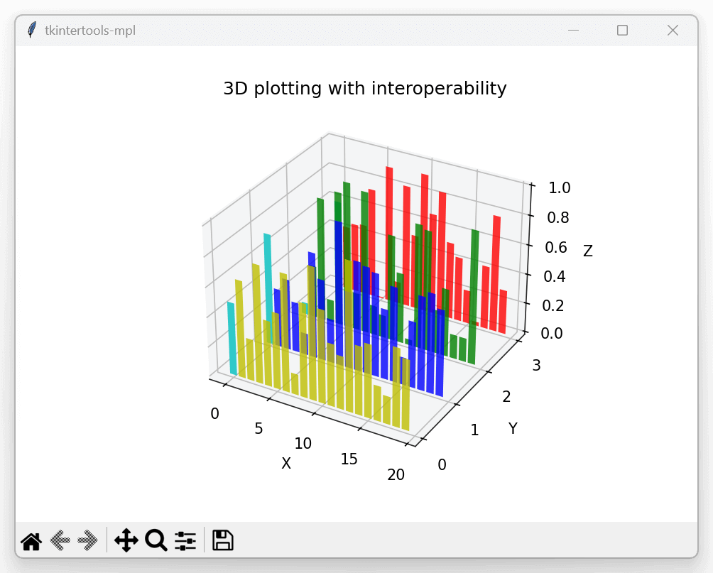

<h1 align="center">tkintertools-mpl</h1>

<p align="center"><a title="Official Website" href="https://xiaokang2022.github.io/tkintertools/">https://xiaokang2022.github.io/tkintertools/</a></p>

<p align="center">Extension package of <code>tkintertools</code> for <code>matplotlib</code></p>

<p align="center">
<a href="https://github.com/Xiaokang2022/tkintertools-mpl/releases"></a>
<a href="https://pypistats.org/packages/tkintertools-mpl"></a>
<a href="https://pepy.tech/project/tkintertools-mpl"></a>
<a href="https://github.com/Xiaokang2022/tkintertools-mpl"></a>
<br/>
<a href="https://github.com/Xiaokang2022/tkintertools-mpl/watchers"></a>
<a href="https://github.com/Xiaokang2022/tkintertools-mpl/forks"></a>
<a href="https://github.com/Xiaokang2022/tkintertools-mpl/stargazers"></a>
<a href="https://github.com/Xiaokang2022/tkintertools-mpl/issues"></a>
<a href="https://github.com/Xiaokang2022/tkintertools-mpl/pulls"></a>
<a href="https://github.com/Xiaokang2022/tkintertools-mpl/discussions"></a>
</p>

<p align="center">
<a href="https://github.com/Xiaokang2022/tkintertools-mpl/pulse"></a>
</p>

<p align="center">
    <a href="https://star-history.com/#Xiaokang2022/tkintertools-mpl&Date">
        <picture>
            <source media="(prefers-color-scheme: dark)" srcset="https://api.star-history.com/svg?repos=Xiaokang2022/tkintertools-mpl&type=Date&theme=dark" />
            <source media="(prefers-color-scheme: light)" srcset="https://api.star-history.com/svg?repos=Xiaokang2022/tkintertools-mpl&type=Date" />
            
        </picture>
    </a>
</p>

📦 Installation
---------------

```shell
pip install tkintertools-mpl
```

### 👀 Preview



```python
import math

import matplotlib.figure
import numpy

import tkintertools
from tkintertools import mpl, theme

mpl.set_mpl_default_theme(theme.get_color_mode())

x = numpy.linspace(-math.tau, math.tau, 100)
y = numpy.sin(x)

figure = matplotlib.figure.Figure()
axes = figure.add_subplot()
axes.plot(x, y)

axes.set(xlabel='x', ylabel='y', title='Plotting based on the theme in tkt')
axes.legend(["$y=sin(x)$"])
axes.grid()

root = tkintertools.Tk((960, 720), title="tkintertools-mpl")
root.center()
canvas = tkintertools.Canvas(auto_zoom=True)
canvas.place(width=960, height=720)
figure_canvas = mpl.FigureCanvas(canvas, figure)
toolbar = mpl.FigureToolbar(canvas, figure_canvas)
figure_canvas.pack(side="top", fill="both", expand=True)

root.mainloop()
```



```python
import matplotlib.figure
import numpy

import tkintertools
from tkintertools import mpl, theme

mpl.set_mpl_default_theme(theme.get_color_mode())

figure = matplotlib.figure.Figure()
axes = figure.add_subplot(projection='3d')

colors = ['r', 'g', 'b', 'y']
yticks = [3, 2, 1, 0]

for c, k in zip(colors, yticks):
    xs = numpy.arange(20)
    ys = numpy.random.rand(20)
    cs = [c] * len(xs)
    cs[0] = 'c'
    axes.bar(xs, ys, zs=k, zdir='y', color=cs, alpha=0.7)

axes.set_xlabel('X')
axes.set_ylabel('Y')
axes.set_zlabel('Z')
axes.set_title("3D plotting with interoperability")

axes.set_yticks(yticks)

root = tkintertools.Tk((960, 720), title="tkintertools-mpl")
root.center()
canvas = tkintertools.Canvas(auto_update=True)
canvas.place(width=960, height=720)
figure_canvas = mpl.FigureCanvas(canvas, figure)
toolbar = mpl.FigureToolbar(canvas, figure_canvas)
figure_canvas.pack(side="top", fill="both", expand=True)

root.mainloop()
```
